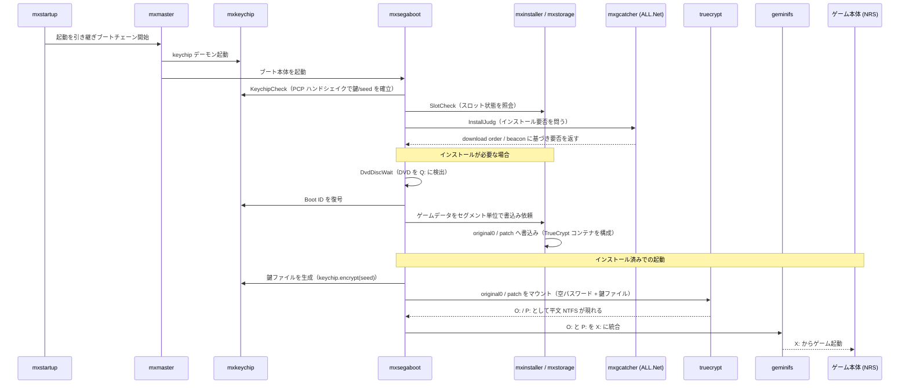
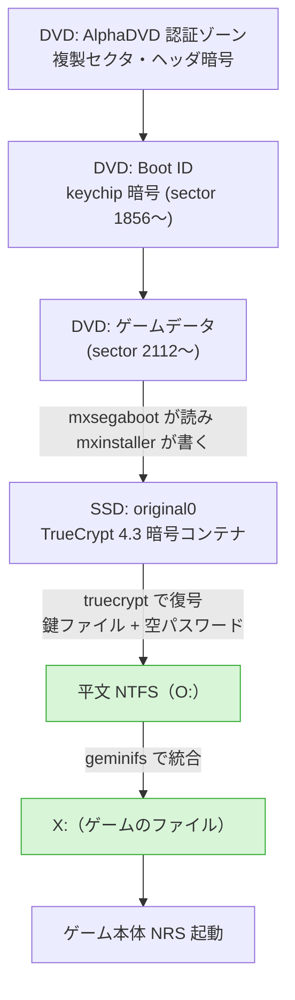
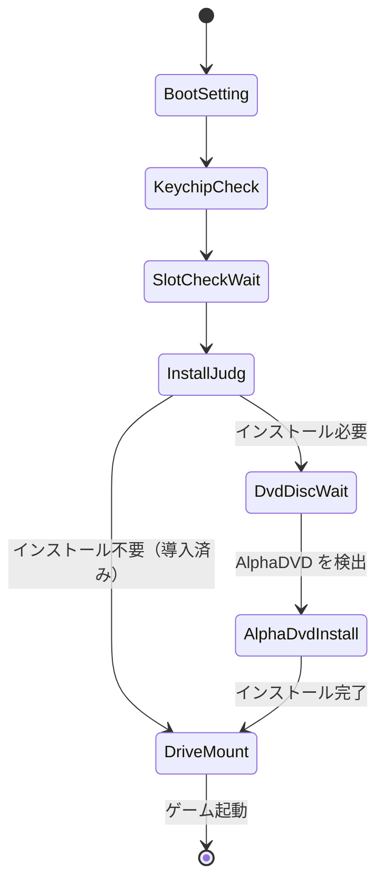
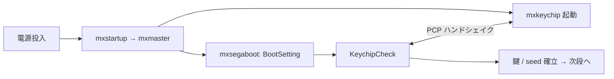
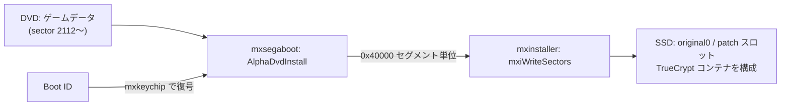
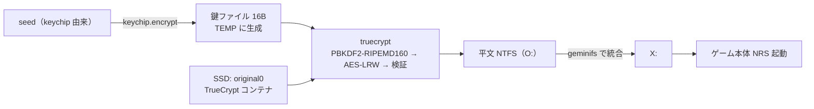

# SBVA (DVR-5001) ISO からのファイル抽出

## 概要 — 何のための文書か、なぜ仕組みが複雑なのか

この文書の目的は、SBVA（DVR-5001）の ISO からゲームのファイルを取り出すことにある。SEGA RingEdge 向けの
インストール DVD で、ゲーム ID は SBVA（NRS v1.00）。本リポジトリ本体が扱う `bbs` 配下の nrs.exe
（SDEY = NRS v4.5.0）とは別物である。

普通にマウントしてもファイルは出てこない。ISO 9660 のディレクトリは空のダミーで、中身は何重にも暗号化
されている。どこでデータが平文になり、何を手に入れればそこに到達できるのかを知るには、実機の RingEdge
基板がこのディスクをどう扱うか（DVD 読み取り → SSD 展開 → ゲーム起動）を理解するしかない。よって本文書は
まず純正プロセスを段階的にたどり、その理解を最後に抽出の具体的な道筋へ落とす、という順で書いている。

防御が幾重にも重なるのは、RingEdge が複製容易な DVD と内蔵 SSD で動く x86 PC ベースの基板で、海賊版を防ぎ
ライセンスと課金を守る必要があったからだ。層はおおまかに四つ:

- **keychip**（内部は DS28CN01）— 基板ごとに固有のハードウェアキーでゲームを正規基板に縛る。鍵がなければ復号できない。
- **AlphaDVD** — DVD 自体のコピー防止（複製セクタ・ヘッダ暗号化）でディスクの丸ごとコピーを妨げる。
- **TrueCrypt** — SSD 上のゲームを暗号コンテナに収め、鍵ファイルを keychip から起動のたびに生成させる。SSD を複製しても keychip がなければ開けない。
- **ALL.Net** — ネットワーク認証・課金の下でしかインストールや起動が進まない。

純正バイナリの逆解析は、純正システムイメージ（ringedge_system 63.01.10）の非パック実行ファイルを対象に
行った。アドレスは Ghidra の static_VA（ImageBase 0x400000）で示す。

## 登場するアプリと役割

| アプリ | 役割 |
|---|---|
| mxstartup | 電源投入後の起動を受け持ち、ブートチェーンを開始する |
| mxmaster | ブートチェーンを統括し、各サービスと mxsegaboot を順に立ち上げる |
| mxkeychip | keychip デーモン。物理キーチップと話し、AES の暗復号オラクルと seed を PCP 経由で提供する |
| mxsegaboot | ブート・DVD 読み取り・インストール・復号・マウントの本体。後述の状態機械を持つ |
| mxinstaller | SSD のスロットへセクタを書き込む（インストールの実書き込み担当） |
| mxstorage | ストレージ層を受け持つ |
| mxgcatcher | BeaconCatcher。ALL.Net の download order / beacon を待ってインストールの要否を立てる（推定を含む） |
| mxgfetcher / mxgdeliver | ネットワーク経由のセグメント取得・配送（役割は文字列・挙動からの推定） |
| mxauthdisc | ディスク認証（amAuthDiscRead）。役割は文字列からの推定 |
| truecrypt | original0 / patch を TrueCrypt 4.3（AES-LRW）でマウントする |
| geminifs | original0（O:）と patch（P:）を X: に統合する |

逆解析でフローまで追えているのは mxsegaboot・mxinstaller・mxkeychip で、mxgfetcher / mxgdeliver / mxauthdisc は
文字列や周辺の呼び出しからの位置づけにとどまる。

## 全体像

電源投入からゲーム起動までのアプリ間の連携を時系列で示すと次のようになる。



データの側から見ると、ディスク上の層が SSD のコンテナを経て平文になるまでの流れはこうなる。抽出にとって
要になるのは、TrueCrypt を復号した時点で初めて平文の NTFS が現れる点である。



mxsegaboot のインストール／起動の判断は、内部の状態機械 `LOADER::ExecServer`（FUN_0040b060）が握っている。
全体を状態で俯瞰すると次の通り。以降のフェーズ A〜D はこの遷移に対応する。



なお mxstartup から mxmaster に至る多段の起動チェーンの細部までは追えていない。ここでは mxmaster が
統括役であるという理解にとどめる。

## フェーズ A：起動と認証

電源が入ると mxstartup から mxmaster がブートチェーンを引き継ぎ、各サービスを順に立ち上げる。mxsegaboot は
最初に BootSetting（FUN_004106d0）で起動時の設定を整え、続く KeychipCheck（FUN_004121f0）で mxkeychip と
PCP のハンドシェイクを行う。ここで keychip の AES オラクルと seed が使える状態になり、以降の復号や鍵ファイル
生成の土台ができる。mxauthdisc によるディスク認証（amAuthDiscRead）もこの段階に位置づくが、その役割は
文字列からの推定である。



## フェーズ B：インストール要否の判定

mxsegaboot は SlotCheckWait（FUN_00412a50）で mxinstaller / mxstorage にスロットの状態（check / install /
complete / empty）を問い合わせる。続く InstallJudg（FUN_00413df0）では、mxgcatcher（BeaconCatcher）が
ALL.Net の download order / beacon を受けてインストールの要否を立てる。つまりインストールの起点は基板側では
なくネットワーク側にあり、正規のサーバから配信指示が来て初めて発火する。これはオフラインの環境では自然には
起こらないため、抽出のためにこの過程を再現しようとすると、ここが大きな難所になる。mxgfetcher / mxgdeliver は
ネットワーク経由のセグメント取得・配送を担うと見られるが、いずれも文字列と挙動からの推定である。

## フェーズ C：DVD の読み取りと SSD への展開

インストールが必要と判断されると、DvdDiscWait（FUN_004143a0）が DVD を Q: にマウントし、AlphaDVD ディスクで
あることを確認する。このとき mxsegaboot が読むディスクの構造は次の通り。

| 絶対セクタ | ボリューム相対 | 内容 |
|---|---|---|
| 0 – 31 | — | AlphaDVD 認証ゾーン |
| 32 – 1343 | — | AlphaDVD 複製セクタ群 |
| 1344 | vol 0 | ISO 9660 ボリューム開始 |
| 1360 | vol 16 | PVD（Volume ID: DVR5001_1_00_00） |
| 1362 – 1854 | vol 18–510 | 全ゼロ |
| 1855 | vol 511 | ディスクヘッダー |
| 1856 – 1893 | vol 512〜 | Boot ID（keychip で暗号化。128 セクタ予約のうち先頭〜38 が実データ） |
| 1984 | vol 640 | 高エントロピーの暗号ブロック（用途は未確定） |
| 2112 – 2574175 | vol 768〜 | ゲームデータ（約 4.9 GB） |

ここで一点、旧版の記述を訂正しておく。以前は「sector 1984 以降は全ゼロのパディング」としていたが、これは
誤りで、実際には高エントロピーの暗号ブロックが置かれている。用途は未確定である。mxsegaboot はディスクを
ボリューム相対の LBA で扱う点にも注意がいる（ディスクヘッダがボリューム先頭の少し手前、絶対セクタ 1855 に
ある）。

ディスクヘッダー（sector 1855 の先頭）は次のような小さな索引で、ゲーム ID とブロックサイズ、Boot ID の
位置などを持つ。

```
000: 00 08 00 00 EB 10 2B 7F 00 02 00 00 53 42 56 41  ......+.....SBVA
010: 00 91 25 00 53 42 54 52 00 00 00 00 00 00 00 00  ..%.SBTR........
```

`00 08 00 00` がブロックサイズ 2048、`53 42 56 41` がゲーム ID "SBVA"、`00 02 00 00` が Boot ID の開始
（ボリュームセクタ 512）を表す。

実際の展開は AlphaDvdInstall（FUN_004150f0）が行う。まず Boot ID を mxkeychip で復号してメタデータを読み、
続いてゲームデータをセグメント（0x40000 バイト単位）に分けて読み出し、mxinstaller に書き込みを依頼する。
mxinstaller 側では mxiThProcInstall（FUN_004089d0）がワーカースレッドで受け、mxiWriteSectors（FUN_004017f0）が
SSD の original0 / patch スロットへ書き込む。書き込み先のセクタはスロットの幾何から決まり、セグメント番号に
比例した連続配置になる。スロットの状態はこの過程で empty → install → complete と遷移する。



抽出の観点で押さえておきたいのは、この段階で SSD に書かれる original0 が、すでに暗号化された TrueCrypt
コンテナだという点である。DVD から SSD へ移しただけでは平文にはならない。平文化はもう一段あとで起こる。

## フェーズ D：ゲーム起動 — データが平文になる地点

インストールが終わってスロットが complete になった状態で再起動すると、mxsegaboot は ExecServer の判断で
DriveMount 経路に進む。ここでまず MakeKeyFile（`LOADER::AppliLoaderMakeKeyFile`、FUN_0040e990）が
鍵ファイルを生成する。中身は `keychip.encrypt(seed)` の 16 バイトで、Windows の TEMP に一時ファイルとして
書き出される。次に AppliLoaderMountSlot が truecrypt を呼び、original0 を O:、patch を P: にマウントする。
マウントのコマンドは

```
truecrypt /q /s /m ro /v  /l<L> /k <keyfile> /h n
```

で、`/p` が無いことからパスワードは空、鍵ファイル（`/k`）だけで開く構成になっている。暗号は TrueCrypt 4.3 の
AES-LRW。最後に geminifs が O: と P: を X: に統合し、ゲーム本体（NRS）が X: から起動する。



抽出にとって本質的なのはこのフェーズである。TrueCrypt をマウントした時点で初めて、コンテナの中身が平文の
NTFS になる。裏を返せば、コンテナと鍵ファイルさえ手元にあれば、実機を動かさずともオフラインで同じ復号が
できる、ということになる。これがあとの抽出の章につながる結び目だ。

ひとつ断っておくと、DriveMount からゲーム起動までの流れは純正バイナリの逆解析から組み立てた筋であって、
本リポジトリの検証環境では通しでは観測できていない。マウントワーカーである `LOADER::WorkerFunc_AppLoader`
（FUN_00418000）が、エミュレーション環境固有の事情で CRT 初期化（static 0x4c802c 付近）で落ちてしまうため
である。マウントコマンドの形や鍵ファイルの作り方は逆解析と実行時のダンプから確認できているが、最後まで
通した観測ではない点は理解しておく必要がある。

## データ暗号モデルのまとめ

ここまでに出てきた暗号を整理しておく。鍵は二段階で効いている。

ひとつ目は keychip の暗号で、Boot ID やディスク上のメタデータに per-sector の AES-128-CBC（鍵 m_Key、
初期ベクタ m_Iv）として掛かっている。ふたつ目は SSD 上の original0 に掛かる TrueCrypt 4.3 の AES-LRW で、
こちらは空パスワードと鍵ファイルで開く。そして鍵ファイル自体は keychip の暗号で作られる
（`keychip.encrypt(m_Seed)`）。つまり二段の暗号が keychip を共通の根として結びついている。

```mermaid
flowchart TD
    KEY["keychip: m_Key / m_Iv / m_Seed"]
    KEY -->|AES-128-CBC| BID["Boot ID / メタデータの復号"]
    KEY -->|encrypt(m_Seed)| KF["鍵ファイル"]
    KF --> TCV["TrueCrypt 4.3 AES-LRW<br/>(空パスワード)"]
    TCV --> PLAIN["平文 NTFS → ゲームのファイル"]
```

抽出に必要な材料はこの図の左側、すなわち keychip の値（m_Key / m_Iv / m_Seed と、そこから作られる鍵ファイル）
と、正しい TrueCrypt LRW の実装、の二つに尽きる。

## ISO からファイルを取り出すには

ここがこの文書の到達点である。先に材料の状況を確認しておくと、抽出に要るものはおおむねそろっている。
keychip の暗号が AES-128-CBC であることは、Boot ID を実際に復号して `BTID`・`SBVA`・`BORDER BREAK` といった
平文が出てくることで確認した（[decrypt_bootid.py](../tools/iso/decrypt_bootid.py)）。TrueCrypt の LRW
パイプラインは公式のテストベクタを通しており（[lrw.py](../tools/iso/lrw.py)）、実装としては正しい。SBVA の
keychip の値も判明している。

| 項目 | 値 |
|---|---|
| AES Key (m_Key) | `6ACB8DC90049927AEACF71C9740B6FF9` |
| AES IV (m_Iv) | `A47A668EC0DA675E10E3A3EBE5328CF0` |
| AppBoot Seed (m_Seed) | `DB86373A5A2E05B963C282D789128D0D` |
| 鍵ファイル（enc(m_Seed)） | `45E546D2F28E9F9C773F6B065A1093B6` |

そのうえで、取り出し方には二つの経路がある。

### 実証済みの経路 — 実機 SSD イメージから

確実に取り出せるのは、実機の SSD イメージを起点にする経路である。SSD は ATA セキュリティでロックされて
いるが、これはアクセスのロックであってデータの暗号化ではなく、静的なキーで解錠できる。解錠後の original0 を
TrueCrypt 4.3 の AES-LRW で復号すると、標準の NTFS が現れ、そのままファイルを取り出せる。実機の SSD イメージ
（別タイトルの NoKey マルチカート）に対して、PBKDF2-RIPEMD160 を用いた復号で 'TRUE' の magic と鍵領域の
CRC が一致し、ボリュームを丸ごと NTFS イメージに復号できることを確認した
（[tc_decrypt_volume.py](../tools/iso/tc_decrypt_volume.py)）。これが現状、ファイルを実際に取り出せる方法で
ある。SBVA を取り出したいなら、SBVA がインストールされた実機ストレージの SSD イメージが要る、ということに
なる。

### DVD 単体の経路と、その壁

対して、手元の DVD 単体だけから取り出す経路には壁がある。前述の通り、鍵ファイルは起動時に keychip から
動的に生成される設計なので、DVD と静的な値だけからオフラインで導けない（未解決）。実行時にダンプした
鍵ファイルは判明値 `45E546D2…` と一致するが、その値で DVD 上のゲームデータを TrueCrypt として開こうとしても、
試した範囲では開かない。具体的には、セグメント境界を中心に AES に加えて Serpent・Twofish まで試したが、
いずれの cipher・オフセットでも TrueCrypt のヘッダは現れなかった。AlphaDVD については、複製セクタとヘッダ
暗号からなる外周の認証層にとどまり、ゲームデータ本体の暗号ではない、という理解でいる。ただし DVD 単体での
TrueCrypt マウントには到達できていないため、この一帯は依然として未解決である。残された筋としては、実機
（または実機相当の環境）でマウント時の鍵ファイルや seed を捕捉して `enc(seed)` をオフラインで再計算する、
といった実行時の観測が現実的だろう。

### 検証手段について

ここまでの確認は、純正のブート／インストール連鎖を micetools 上でエミュレートして観測することで行った。
あくまで本リポジトリでの検証手段であって、純正プロセスそのものではない。再現を要する場合の足がかりとして
記すにとどめ、手順の詳細はここには持たない。

## 付録

### 主要関数アドレス（純正バイナリの逆解析由来、static_VA）

mxsegaboot:

| 関数 | アドレス | 役割 |
|---|---|---|
| `LOADER::ExecServer` | FUN_0040b060 | ブート／インストールの状態機械 |
| `WorkerFunc_BootSetting` | FUN_004106d0 | 起動時設定 |
| `WorkerFunc_KeychipCheck` | FUN_004121f0 | keychip ハンドシェイク |
| `WorkerFunc_SlotCheckingWait` | FUN_00412a50 | スロット状態照会 |
| `WorkerFunc_InstallJudg` | FUN_00413df0 | インストール要否判定 |
| `WorkerFunc_DvdDiscWait` | FUN_004143a0 | DVD 検出 |
| `WorkerFunc_AlphaDvdInstall` | FUN_004150f0 | DVD 読み取り・展開の本体 |
| `WorkerFunc_AppLoader` | FUN_00418000 | 鍵ファイル生成 → truecrypt → geminifs |
| `AppliLoaderMakeKeyFile` | FUN_0040e990 | 鍵ファイル生成（keychip.encrypt(seed)） |
| `LoadBootIDHeader` | 0x418f00 | Boot ID ヘッダ読み込み・keychip 復号 |
| `KEYCHIP_PROCESS_ACCESS::Encrypt` | FUN_0040a140 | keychip AES-128-CBC 暗号 |
| `KEYCHIP_PROCESS_ACCESS::Decrypt` | FUN_0040a030 | keychip AES-128-CBC 復号 |

mxinstaller:

| 関数 | アドレス | 役割 |
|---|---|---|
| `mxiDispatchInstall` | FUN_00402430 | "install" PCP ハンドラ |
| `mxiThProcInstall` | FUN_004089d0 | 書き込みワーカー本体 |
| `mxiWriteSectors` | FUN_004017f0 | SetFilePointer + WriteFile による実書き込み |
| `mxiDispatchQuerySlotStatus` | FUN_00401e70 | スロット状態の返答 |
| `mxiDispatchUninstall` | FUN_00402d60 | スロットを empty にリセット |

### 解析ツール

抽出と検証に使うスクリプトは [tools/iso/](../tools/iso/) にある。主なものは Boot ID を per-sector の
AES-CBC で復号する [decrypt_bootid.py](../tools/iso/decrypt_bootid.py)、TrueCrypt の LRW を実装し公式
テストベクタで検証する [lrw.py](../tools/iso/lrw.py)、TrueCrypt 4.3 ボリュームを丸ごと NTFS へ復号する
[tc_decrypt_volume.py](../tools/iso/tc_decrypt_volume.py)、セクタ単位のエントロピーで暗号化領域の境界を
見る [scan_layout.py](../tools/iso/scan_layout.py)。

### 外部資料

- [bsnk のドキュメント](https://sega.bsnk.me/ringedge/) — RingEdge のセキュリティ、geminifs、AlphaDVD の解説。
  外周の認証層と全体像の理解に。
- [micetools](https://gitea.tendokyu.moe/syncsyncsynchalt/micetools) — RingEdge の am*/PCP/keychip の C クリーン
  ルーム実装。本文の検証（純正ブート／インストール連鎖のエミュレーション）に用いた。
- [ArcadeHustle の RingEdge_NoKey_softmod](https://github.com/ArcadeHustle/RingEdge_NoKey_softmod) — TrueCrypt 4.3 の
  AES-LRW 参照実装、鍵ファイル生成、keydump の手順など、TrueCrypt 層の裏取りに用いた。
- [TrueCrypt Volume Format Specification](https://www.truecrypt71a.com/documentation/technical-details/truecrypt-volume-format-specification/)
  — TrueCrypt 4.x のヘッダ形式（CRC32 検証、master key のオフセットなど）。truecrypt.org 閉鎖後の 7.1a ミラー。
