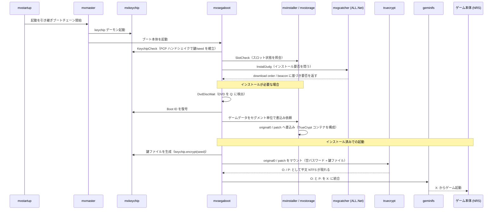
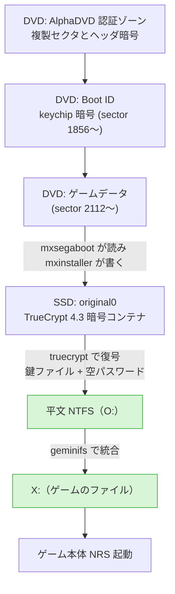
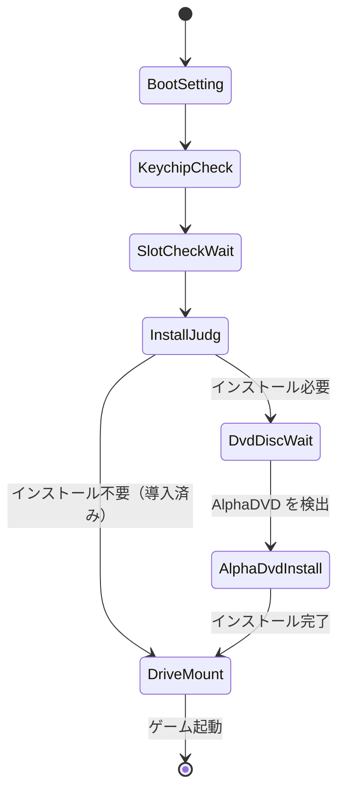
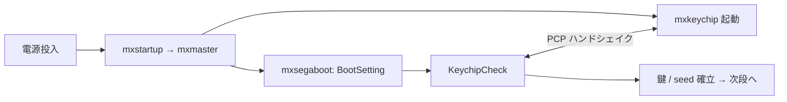
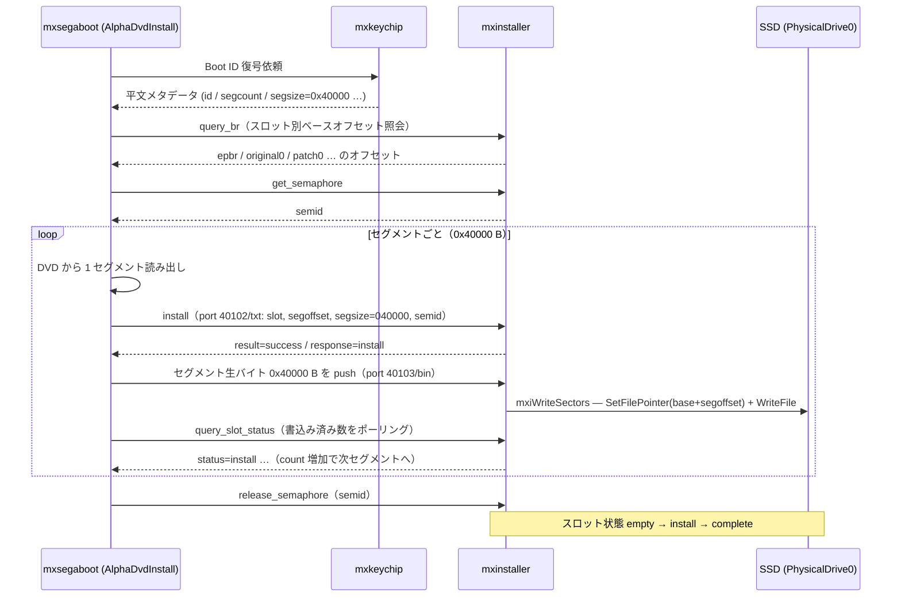
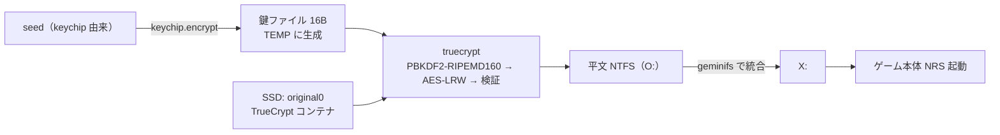
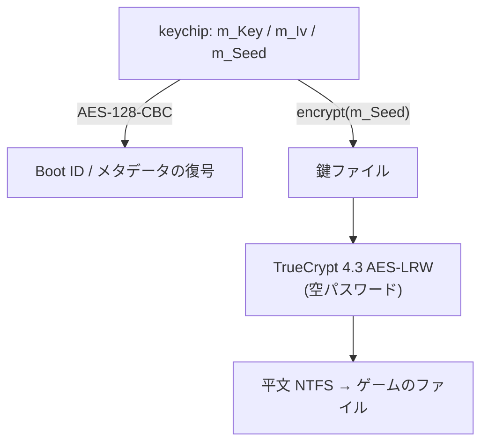

# SBVA (DVR-5001) ISO からのファイル抽出

## 文書の目的と、仕組みが複雑な理由

この文書の目的は、SBVA（DVR-5001）の ISO からゲームのファイルを取り出すことにある。
SEGA RingEdge 向けのインストール DVD で、ゲーム ID は SBVA（NRS v1.00）である。
本リポジトリ本体が扱う `bbs` 配下の nrs.exe（SDEY = NRS v4.5.0）とは別物である。

普通にマウントしてもファイルは出てこない。
ISO 9660 のディレクトリは空のダミーで、中身は何重にも暗号化されている。
データがどこで平文になり、何を手に入れればそこに到達できるのかを知るには、実機の RingEdge 基板がこのディスクをどう扱うか（DVD 読み取りから SSD 展開を経てゲーム起動まで）を理解するしかない。
そこで本文書は、まず純正プロセスを段階的にたどり、その理解を最後に抽出の具体的な道筋へ落とす順で書く。

防御が幾重にも重なるのは、RingEdge が複製容易な DVD と内蔵 SSD で動く x86 PC ベースの基板で、海賊版を防いでライセンスと課金を守る必要があったからだ。
層はおおまかに四つある。

- **keychip**（内部は DS28CN01）：基板ごとに固有のハードウェアキーでゲームを正規基板に縛る。鍵がなければ復号できない。
- **AlphaDVD**：DVD 自体のコピー防止（複製セクタとヘッダ暗号化）でディスクの丸ごとコピーを妨げる。
- **TrueCrypt**：SSD 上のゲームを暗号コンテナに収め、鍵ファイルを keychip から起動のたびに生成させる。SSD を複製しても keychip がなければ開けない。
- **ALL.Net**：ネットワーク認証と課金の下でしかインストールや起動が進まない。

調査は純正バイナリのリバースエンジニアリングによる。
対象は純正システムイメージ（ringedge_system 63.01.10）の非パック実行ファイルで、アドレスは Ghidra の static_VA（ImageBase 0x400000）で示す。

## 登場するアプリと役割

| アプリ | 役割 |
|---|---|
| mxstartup | 電源投入後の起動を受け持ち、ブートチェーンを開始する |
| mxmaster | ブートチェーンを統括し、各サービスと mxsegaboot を順に立ち上げる |
| mxkeychip | keychip デーモン。物理キーチップと話し、AES の暗復号オラクルと seed を PCP 経由で提供する |
| mxsegaboot | ブート、DVD 読み取り、インストール、復号、マウントの本体。後述の状態機械を持つ |
| mxinstaller | SSD のスロットへセクタを書き込む（インストールの実書き込み担当） |
| mxstorage | ストレージ層を受け持つ |
| mxgcatcher | BeaconCatcher。ALL.Net の download order / beacon を待ってインストールの要否を立てる（推定を含む） |
| mxgfetcher / mxgdeliver | ネットワーク経由のセグメント取得と配送（役割は文字列と挙動からの推定） |
| mxauthdisc | ディスク認証（amAuthDiscRead）。役割は文字列からの推定 |
| truecrypt | original0 / patch を TrueCrypt 4.3（AES-LRW）でマウントする |
| geminifs | original0（O:）と patch（P:）を X: に統合する |

## original0 と patch とは

以降たびたび出てくる **original0** と **patch** は、いずれも SSD 上に置かれた**スロット**で、中身は TrueCrypt 4.3（AES-LRW）の暗号コンテナである。
インストール時に mxinstaller が DVD から読み出したゲームデータをこのスロットへ書き込み、その状態は empty → install → complete と遷移する。

| スロット | 役割 | 復号後のドライブ |
|---|---|---|
| original0 | ゲーム本体（ベースイメージ） | O: |
| patch | original0 に対する更新／差分の層 | P: |

両者とも暗号コンテナなので、SSD を複製しただけでは読めない。
起動のたびに keychip から生成される鍵ファイル（`keychip.encrypt(seed)` の 16 バイト）と空パスワードで truecrypt がマウントして、初めて平文 NTFS（O: / P:）が現れる。
最後に geminifs が O:（ベース）と P:（パッチ）を 1 つの仮想ドライブ X: に重ね合わせ（overlay/union マウント）、ゲーム本体 NRS はこの X: から起動する。
geminifs の実体は、純正イメージに含まれる SEGA 製のカーネル仮想ファイルシステムドライバ（`geminifs.sys`、"Geminifs Virtual Disk"）である。

つまり original0 が出荷時の本体、patch があとから当てる差分、X: が両者を統合してゲームから見える最終的なファイルツリー、という三段構成になっている。
抽出の観点では、データが平文になるのは TrueCrypt マウント時点なので、本当に要るのは「original0 コンテナと正しい鍵ファイル」である（詳細は後述の抽出の章）。

なお `geminifs.sys` 本体でのマウント仕様や、original0 / patch スロットの正確なセクタ配置（スロット幾何）までは未検証である。
ここでの説明は、逆解析と純正ドライバ定義からの理解にとどまる。

## 全体像

電源投入からゲーム起動までのアプリ間の連携を時系列で示すと次のようになる。



データの側から見ると、ディスク上の層が SSD のコンテナを経て平文になるまでの流れはこうなる。
抽出にとって要になるのは、TrueCrypt を復号した時点で初めて平文の NTFS が現れる点である。



mxsegaboot のインストールと起動の判断は、内部の状態機械 `LOADER::ExecServer`（FUN_0040b060）が握っている。
全体を状態で俯瞰すると次の通りで、以降のフェーズ A〜D はこの遷移に対応する。



なお mxstartup から mxmaster に至る多段の起動チェーンの細部までは追えていない。
ここでは mxmaster が統括役であるという理解にとどめる。

## フェーズ A：起動と認証

電源が入ると、mxstartup から mxmaster がブートチェーンを引き継ぎ、各サービスを順に立ち上げる。
mxsegaboot は最初に BootSetting（FUN_004106d0）で起動時の設定を整え、続く KeychipCheck（FUN_004121f0）で mxkeychip と PCP のハンドシェイクを行う。
ここで keychip の AES オラクルと seed が使える状態になり、以降の復号や鍵ファイル生成の土台ができる。
mxauthdisc によるディスク認証（amAuthDiscRead）もこの段階に位置づくが、その役割は文字列からの推定である。



## フェーズ B：インストール要否の判定

mxsegaboot は SlotCheckWait（FUN_00412a50）で mxinstaller / mxstorage にスロットの状態を問い合わせる。
返る状態は complete / empty / error などで、検証（micetools 上のエミュレーション）では `query_slot_status` の応答として実際に観測している（original0 = complete、patch0 = empty など）。
続く InstallJudg（FUN_00413df0）が、このスロット結果とネットワーク側の配信状況からインストールの要否を判定する。
判定がネットワークに依存するという構造自体は確認している。
ただしその配信の意味づけ、すなわち正規環境では mxgcatcher（BeaconCatcher）が ALL.Net の配信指示（download order / beacon）を受けて初めて「インストール必要」を立てるという理解は、bsnk の資料と、文字列および挙動からの推定である。

検証では、InstallJudg の通信応答を偽装するのではなく、ExecServer がこの判定結果を見て分岐するところを直接上書きし、「インストール必要」側へ常に倒すことで先へ進めた。
InstallJudg 関数自体は実行させている（内部で REMOUNT_DEVICE を行い、抽出対象の ISO を Q: にマウントする副作用が必要なため）。
上書きしたのは結果による分岐だけで、これにより次のフェーズ C（DvdDiscWait → AlphaDvdInstall）へ進む。
あわせて、SlotCheckWait の完了後に ExecServer が InstallJudg へ正しく進めるよう、分岐を一箇所補正している（SlotCheckWait は正常終了するが、void 返りで残るレジスタ値を ExecServer が失敗と誤認し、エラー状態へ逸れるため）。
当てたパッチの番地は付録に記す。

## フェーズ C：DVD の読み取りと SSD への展開

インストールが必要と判断されると、DvdDiscWait（FUN_004143a0）が DVD を Q: にマウントし、AlphaDVD ディスクであることを確認する。
このとき mxsegaboot が読むディスクの構造は次の通り。

| 絶対セクタ | ボリューム相対 | 内容 |
|---|---|---|
| 0 – 31 | — | AlphaDVD 認証ゾーン |
| 32 – 1343 | — | AlphaDVD 複製セクタ群 |
| 1344 | vol 0 | ISO 9660 ボリューム開始 |
| 1360 | vol 16 | PVD（Volume ID: DVR5001_1_00_00） |
| 1362 – 1854 | vol 18–510 | 全ゼロ |
| 1855 | vol 511 | ディスクヘッダー |
| 1856 – 1893 | vol 512〜 | Boot ID（keychip で暗号化。128 セクタ予約のうち先頭〜38 が実データ） |
| 1984 | vol 640 | 高エントロピーの暗号ブロック（用途は未確定） |
| 2112 – 2574175 | vol 768〜 | ゲームデータ（約 4.9 GB） |

表について一点、訂正と補足をしておく。
以前は「sector 1984 以降は全ゼロのパディング」と記していたが、これは誤りで、実際には高エントロピーの暗号ブロックが置かれている。
用途は分かっておらず、調査自体に誤りがある可能性も残るため、再確認を要する。

もう一点、mxsegaboot がディスクをボリューム相対の LBA で扱う点にも注意がいる。
ディスクヘッダはボリューム先頭の少し手前、絶対セクタ 1855 に置かれている。
このディスクヘッダー（sector 1855 の先頭）は次のような小さな索引で、ゲーム ID とブロックサイズ、Boot ID の位置などを持つ。

```
000: 00 08 00 00 EB 10 2B 7F 00 02 00 00 53 42 56 41  ......+.....SBVA
010: 00 91 25 00 53 42 54 52 00 00 00 00 00 00 00 00  ..%.SBTR........
```

`00 08 00 00` がブロックサイズ 2048、`53 42 56 41` がゲーム ID "SBVA"、`00 02 00 00` が Boot ID の開始（ボリュームセクタ 512）を表す。

実際の展開は AlphaDvdInstall（FUN_004150f0）が行う。
まず Boot ID を mxkeychip で復号してメタデータを読み、続いてゲームデータをセグメント（0x40000 バイト単位）に分けて読み出し、mxinstaller に書き込みを依頼する。

mxsegaboot と mxinstaller の受け渡しは、PCP の二本のチャネルで行う。
コマンド系（port 40102、テキスト）に install リクエスト（slot、segoffset、segcount、segsize=0x40000、id、version、semid などのメタデータ）を送り、mxinstaller がスロット状態を検証して受理すると、続いてデータ系（port 40103、バイナリ）を開いてそのセグメントの 0x40000 バイトを流し込む。
mxinstaller 側では mxiThProcInstall（FUN_004089d0）がワーカースレッドで受け、mxiWriteSectors（FUN_004017f0）が SetFilePointer + WriteFile で SSD（`\\.\PhysicalDrive0`）へ書き込む。
書き込み先セクタは、Boot Record（`query_br` が返すスロット別のベースオフセット）とセグメント番号から決まり、ベースに segoffset を比例させた連続配置になる。

転送は 1 セグメントずつのロックステップで進む。
mxsegaboot はセグメントを書くたびにスロット状態（書込み済み数）をポーリングし、カウントが増えてから次のセグメントを送る。
このポーリング自体が、非同期のバイナリ転送を駆動している。
一連の往復は `get_semaphore` / `release_semaphore` のセマフォで囲まれた排他セッションで行われ、スロットの状態はこの過程で empty → install → complete と遷移する。

受け渡される値の具体例を挙げる（検証環境で観測した SDEY のもので、フィールド書式を示すための例である。SBVA なら `id=SBVA` と各数値が変わるだけで、形は同一になる）。
install リクエストでは数値が 16 進、`query_slot_status` の応答では 10 進でエンコードされるが、同じ画像を指すので一致する（例：`segcount=fe3a` = 65082、`segsize=040000` = 262144、`osver=450a01` = 4524545、`ossegcount=06d1` = 1745）。

```
# コマンド系 port 40102（テキスト）— 1 セグメントの書込み依頼（16 進）
C→S: request=install&slot=patch0&segoffset=3&id=SDEY&version=010061&time=20181029150736
     &segcount=fe3a&segsize=040000&hw=AAS&instant=3&osver=450a01&ossegcount=06d1
     &orgtime=20181029150736&orgversion=10061&semid=<id>
S→C: result=success&response=install

# データ系 port 40103（バイナリ）— そのセグメントの生バイト 0x40000 B をそのまま push

# 進捗ポーリング（10 進）— 書込み済み数の確認に使う slot status
C→S: request=query_slot_status&slot=original0
S→C: result=success&status=complete&id=SDEY&version=65633&time=20181029150736
     &segcount=65082&segsize=262144&hw=AAS&instant=0&osver=4524545
     &ossegcount=1745&orgtime=20181029150736&orgversion=65633
```

各フィールドの意味は次のとおり。

| フィールド | 意味 |
|---|---|
| `slot` | 書込み先スロット（original0 / patch0 …） |
| `segoffset` | スロット内のセグメント番号 |
| `segcount` / `segsize` | 総セグメント数 / 1 セグメント長（0x40000 B） |
| `id` / `version` / `time` | ゲーム ID・アプリ版・ビルド日時 |
| `orgtime` / `orgversion` | ベース画像の版（どの original に当たる patch か） |
| `hw` | 基板ファミリ |
| `semid` | セマフォセッション ID |



ここまでの受け渡し機構は、micetools の am ライブラリ実装（amInstall）とランタイム観測で裏取りした。
スロットの正確なセクタ配置（スロット幾何）の精密値までは未検証である。

抽出の観点で押さえておきたいのは、この段階で SSD に書かれる original0 が、すでに暗号化された TrueCrypt コンテナだという点である。
DVD から SSD へ移しただけでは平文にはならない。
平文化はもう一段あとで起こる。

## フェーズ D：ゲーム起動とデータが平文になる地点

インストールが終わってスロットが complete になった状態で再起動すると、mxsegaboot は ExecServer の判断で DriveMount 経路に進む。
ここでまず MakeKeyFile（`LOADER::AppliLoaderMakeKeyFile`、FUN_0040e990）が鍵ファイルを生成する。
中身は `keychip.encrypt(seed)` の 16 バイトで、Windows の TEMP に一時ファイルとして書き出される。
次に AppliLoaderMountSlot が truecrypt を呼び、original0 を O:、patch を P: にマウントする。
マウントのコマンドは次の形になる。

```
truecrypt /q /s /m ro /v  /l<L> /k <keyfile> /h n
```

`/p` が無いことからパスワードは空で、鍵ファイル（`/k`）だけで開く構成になっている。
暗号は TrueCrypt 4.3 の AES-LRW である。
最後に geminifs が O: と P: を X: に統合し、ゲーム本体（NRS）が X: から起動する。



抽出にとって本質的なのは、このフェーズである。
TrueCrypt をマウントした時点で初めて、コンテナの中身が平文の NTFS になる。
裏を返せば、コンテナと鍵ファイルさえ手元にあれば、実機を動かさずともオフラインで同じ復号ができる。
これが、あとの抽出の章につながる結び目だ。

ひとつ断っておくと、DriveMount からゲーム起動までの流れは、純正バイナリの逆解析から組み立てた筋であって、本リポジトリの検証環境では通しでは観測できていない。
マウントワーカーである `LOADER::WorkerFunc_AppLoader`（FUN_00418000）が、エミュレーション環境固有の事情で CRT 初期化（static 0x4c802c 付近）で落ちてしまうためである。
マウントコマンドの形や鍵ファイルの作り方は逆解析と実行時のダンプから確認できているが、最後まで通した観測ではない。

## データ暗号モデルのまとめ

ここまでに出てきた暗号を整理する。
鍵は二段階で効いている。

ひとつ目は keychip の暗号で、Boot ID やディスク上のメタデータに per-sector の AES-128-CBC（鍵 m_Key、初期ベクタ m_Iv）として掛かっている。
ふたつ目は SSD 上の original0 に掛かる TrueCrypt 4.3 の AES-LRW で、こちらは空パスワードと鍵ファイルで開く。
そして鍵ファイル自体は keychip の暗号で作られる（`keychip.encrypt(m_Seed)`）。
つまり二段の暗号が、keychip を共通の根として結びついている。



抽出に必要な材料は、この図の左側である。
すなわち keychip の値（m_Key / m_Iv / m_Seed と、そこから作られる鍵ファイル）と、正しい TrueCrypt LRW の実装の二つである。

## ISO からファイルを取り出すには

ここが、この文書の到達点である。
先に材料の状況を確認しておくと、抽出に要るものはおおむねそろっている。
keychip の暗号が AES-128-CBC であることは、Boot ID を実際に復号して `BTID` や `SBVA` といった平文が出てくることで確認した（[decrypt_bootid.py](../tools/iso/decrypt_bootid.py)）。
TrueCrypt の LRW パイプラインは公式のテストベクタを通しており（[lrw.py](../tools/iso/lrw.py)）、実装としては正しい。
SBVA の keychip の値も判明している。

| 項目 | 値 |
|---|---|
| AES Key (m_Key) | `6ACB8DC90049927AEACF71C9740B6FF9` |
| AES IV (m_Iv) | `A47A668EC0DA675E10E3A3EBE5328CF0` |
| AppBoot Seed (m_Seed) | `DB86373A5A2E05B963C282D789128D0D` |
| 鍵ファイル（enc(m_Seed)） | `45E546D2F28E9F9C773F6B065A1093B6` |

そのうえで、取り出せるかどうかは起点による。
DVD 単体、実機 SSD、NoKey イメージの三つを比較する。

| 項目 | DVD単体（SBVA） | 実機SSD（SBVA正規） | NoKeyイメージ（別タイトル） |
|---|---|---|---|
| 媒体・中身 | install前のキーチップ暗号データ（sector 2112〜） | install済み TrueCrypt コンテナ | install済み TrueCrypt コンテナ |
| TrueCryptコンテナ(original0) | ❌ 無い | ✅ ある | ✅ ある |
| ATA解錠 | — | 静的 ATA キーで解錠（暗号化ではない） | 同左 |
| 鍵ファイルの出所 | キーチップが動的生成 | キーチップ由来（値判明 `45E546D2…`） | 静的・既知（キーチップ非依存） |
| キーチップ要否 | 必要（install/mount） | mount時に必要（本来） | 不要 |
| オフライン復号 | ❌ できない | △ 既知鍵で可、ただし現物 SSD が要る | ⭕ そのままできる（実証済み） |
| 実機での起動 | install を経れば可 | ✅ 正規キーチップが要る | ✅ キーチップ無しで動く |
| 結論 | 詰み（未解決） | SSD 入手だけが条件 | 取り出し・動作とも成立 |

実証済みなのは、実機 SSD を起点とする経路である。
ATA ロックはアクセス制限であって暗号化ではなく、静的キーで解錠すれば生バイトが読める。
解錠後の original0 を TrueCrypt 4.3 の AES-LRW で復号すると標準 NTFS が現れ、そのままファイルを取り出せる。
実際、別タイトルの NoKey マルチカート SSD イメージに対し、PBKDF2-RIPEMD160 で復号して `'TRUE'` magic と鍵領域 CRC の一致を確認し、ボリュームを丸ごと NTFS へ復号できた（[tc_decrypt_volume.py](../tools/iso/tc_decrypt_volume.py)）。
NoKey 検体が解けたのは、鍵ファイルが静的かつ既知だったためである。
SBVA は鍵がキーチップ由来なので、取り出すには SBVA インストール済みの実機 SSD イメージ（すなわち基板）が要る。

DVD 単体では取り出せない。
DVD のデータは TrueCrypt コンテナではなく、コンテナは install 時にキーチップで復号して再構成し、初めて SSD 上にできる。
鍵ファイル値（`45E546D2…`）は判明しているが、開く相手のコンテナが DVD に無い。
実際、AES、Serpent、Twofish を各オフセットで試しても `'TRUE'` ヘッダは出なかった。
AlphaDVD は複製セクタとヘッダ暗号の外周認証層であって、ゲームデータ本体の暗号ではない。
コンテナを自作するにもキーチップ（動的な鍵生成）が要り、オフラインの関門が閉じる。
残る筋は、実機相当の環境でマウント時の鍵ファイルや seed を捕捉して `enc(seed)` を再計算する実行時観測だが、現実的には SBVA 入りの実機 SSD を入手するのが早い。

> **検証手段**：ここまでの確認は、純正のブート／インストール連鎖を micetools 上でエミュレートして観測したものである。
> 本リポジトリの検証手段であって純正プロセスそのものではなく、手順の詳細はここには持たない。

## 付録

### 主要関数アドレス（純正バイナリの逆解析由来、static_VA）

mxsegaboot:

| 関数 | アドレス | 役割 |
|---|---|---|
| `LOADER::ExecServer` | FUN_0040b060 | ブート／インストールの状態機械 |
| `WorkerFunc_BootSetting` | FUN_004106d0 | 起動時設定 |
| `WorkerFunc_KeychipCheck` | FUN_004121f0 | keychip ハンドシェイク |
| `WorkerFunc_SlotCheckingWait` | FUN_00412a50 | スロット状態照会 |
| `WorkerFunc_InstallJudg` | FUN_00413df0 | インストール要否判定 |
| `WorkerFunc_DvdDiscWait` | FUN_004143a0 | DVD 検出 |
| `WorkerFunc_AlphaDvdInstall` | FUN_004150f0 | DVD 読み取り・展開の本体 |
| `WorkerFunc_AppLoader` | FUN_00418000 | 鍵ファイル生成 → truecrypt → geminifs |
| `AppliLoaderMakeKeyFile` | FUN_0040e990 | 鍵ファイル生成（keychip.encrypt(seed)） |
| `LoadBootIDHeader` | 0x418f00 | Boot ID ヘッダ読み込み・keychip 復号 |
| `KEYCHIP_PROCESS_ACCESS::Encrypt` | FUN_0040a140 | keychip AES-128-CBC 暗号 |
| `KEYCHIP_PROCESS_ACCESS::Decrypt` | FUN_0040a030 | keychip AES-128-CBC 復号 |

mxinstaller:

| 関数 | アドレス | 役割 |
|---|---|---|
| `mxiDispatchInstall` | FUN_00402430 | "install" PCP ハンドラ |
| `mxiThProcInstall` | FUN_004089d0 | 書き込みワーカー本体 |
| `mxiWriteSectors` | FUN_004017f0 | SetFilePointer + WriteFile による実書き込み |
| `mxiDispatchQuerySlotStatus` | FUN_00401e70 | スロット状態の返答 |
| `mxiDispatchUninstall` | FUN_00402d60 | スロットを empty にリセット |

### フェーズ B 再現で当てたパッチ（検証時、static_VA）

オフラインで InstallJudg が止まる問題（本文フェーズ B 参照）を越えるために、エミュレーション上の mxsegaboot へ当てた最小限のパッチである。
判定そのものは走らせ、ExecServer の分岐だけを上書きしている。
出典は `micetools/dll/dllmain.c`（ランタイム観測）。

| アドレス | 内容 | 役割 |
|---|---|---|
| 0x0040b4f7 | JZ → JMP | SlotCheckWait 完了後、ExecServer を InstallJudg へ前進させる（void 返りの残レジスタによる誤判定を回避） |
| 0x0040b58b | JNZ → NOP | `CMP EAX,2` 直後の分岐を潰し、InstallJudg 結果を常に「インストール必要」側へ倒す |

### 解析ツール

抽出と検証に使うスクリプトは [tools/iso/](../tools/iso/) にある。
主なものは、Boot ID を per-sector の AES-CBC で復号する [decrypt_bootid.py](../tools/iso/decrypt_bootid.py)、TrueCrypt の LRW を実装し公式テストベクタで検証する [lrw.py](../tools/iso/lrw.py)、TrueCrypt 4.3 ボリュームを丸ごと NTFS へ復号する [tc_decrypt_volume.py](../tools/iso/tc_decrypt_volume.py)、セクタ単位のエントロピーで暗号化領域の境界を見る [scan_layout.py](../tools/iso/scan_layout.py) である。

### 外部資料

- [bsnk のドキュメント](https://sega.bsnk.me/ringedge/)：RingEdge のセキュリティ、geminifs、AlphaDVD の解説。外周の認証層と全体像の理解に用いる。
- [micetools](https://gitea.tendokyu.moe/syncsyncsynchalt/micetools)：RingEdge の am*/PCP/keychip の C クリーンルーム実装。本文の検証（純正ブート／インストール連鎖のエミュレーション）に用いた。
- [ArcadeHustle の RingEdge_NoKey_softmod](https://github.com/ArcadeHustle/RingEdge_NoKey_softmod)：TrueCrypt 4.3 の AES-LRW 参照実装、鍵ファイル生成、keydump の手順など、TrueCrypt 層の裏取りに用いた。
- [TrueCrypt Volume Format Specification](https://www.truecrypt71a.com/documentation/technical-details/truecrypt-volume-format-specification/)：TrueCrypt 4.x のヘッダ形式（CRC32 検証、master key のオフセットなど）。truecrypt.org 閉鎖後の 7.1a ミラー。
